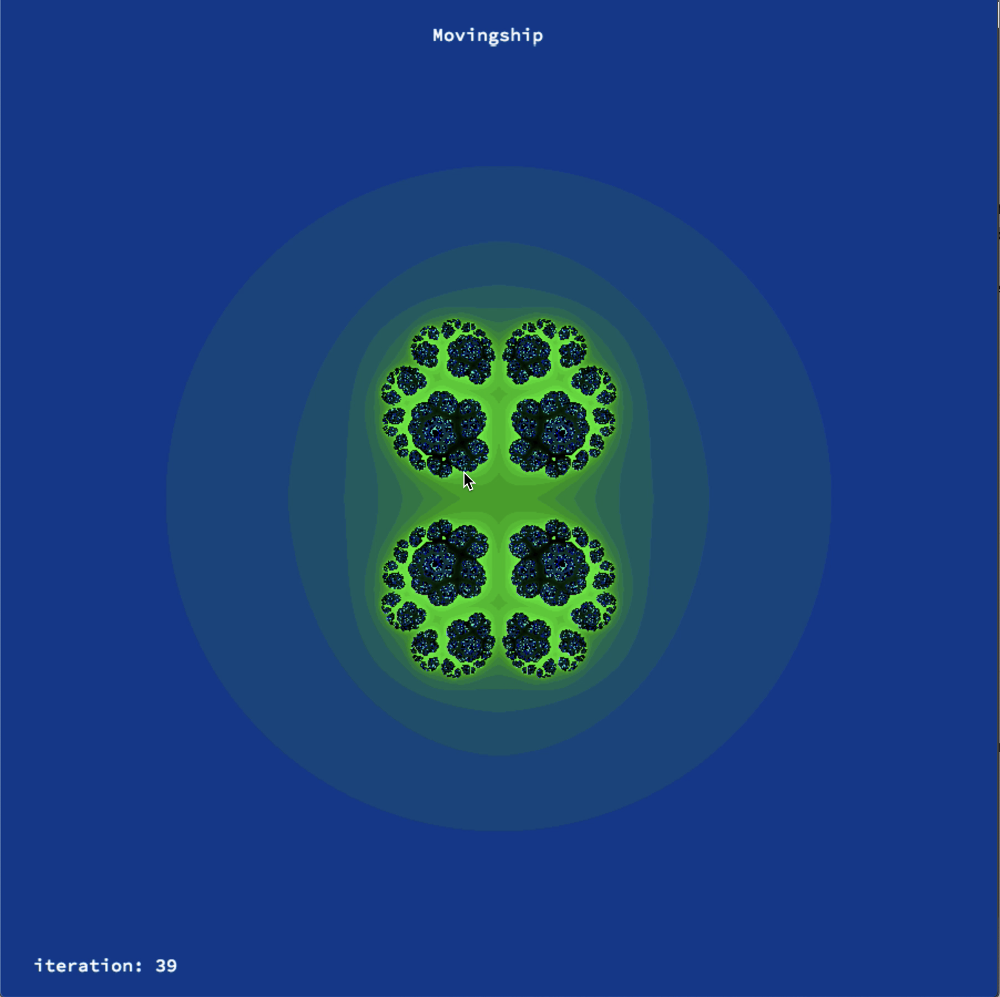
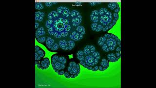

<div align="center">  </div>

# Fractol @ 1337

2nd project of the Graphic Branch of 42. Fractol is a project aimed at exploring fractals, mathematical sets that exhibit a repeating pattern displayed at every scale.


## Features ##
 * Render different fractals: mandelbrot, julia, burning ship...
 * A multithreaded fractal renderer.
 * Different color schemes
 * linear coloring


## Compiling ##

  ### To compile: ##
  ```
  make
  ```
  ### Clean objects ###
  ```
  make clean
  ```
  ### Clean objects and programs ###
  ```
  make fclean
  ```
  ### Re-compile ###
  ```
  make re
  ```

## Executing ##
```
  ./fractal  [option]
```

## Demo ##

[](https://www.youtube.com/watch?v=WVHs5iDvoGU "Fractol | 1337")
  

## Licence ##
[MIT](https://choosealicense.com/licenses/mit) License.
